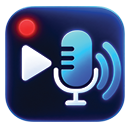

<div align="center" dir="rtl">
  
  <h1>Dubly</h1>
  <h3>هر صدایی در مرورگر، به زبان شما.</h3>
  <p>افزونهٔ متن‌باز Chrome برای دوبلهٔ زنده، ترجمهٔ صوتی، زیرنویس شناور و تایپ صوتی با API Key شخصی کاربر.</p>
  <p>
    <a href="README.md">🇮🇷 فارسی</a>
    &nbsp;•&nbsp;
    <a href="README.en.md">🇬🇧 English</a>
  </p>
  <p>
    
    <a href="LICENSE"></a>
    
    
  </p>
  <p>
    <a href="https://chromewebstore.google.com/detail/dubly/fendjlfddioginhjfehfchdmoddlbnlp"><strong>نصب از Chrome Web Store</strong></a>
  </p>
</div>

---

## Dubly چیست؟

Dubly صدای در حال پخش از تب انتخاب‌شدهٔ Chrome را دریافت می‌کند و ترجمه را به‌صورت صدای دوبله‌شده یا زیرنویس شناور در همان تجربهٔ مرور نمایش می‌دهد. برای استفاده لازم نیست فایل صوتی یا ویدیویی را دانلود کنید، آن را در سرویس دیگری آپلود کنید یا از صفحهٔ فعلی خارج شوید.

Dubly به پلتفرم خاصی مانند YouTube محدود نیست. این افزونه برای هر تب قابل‌دسترسی طراحی شده است که Chrome اجازهٔ دریافت صدای آن را بدهد؛ بنابراین وجود ویدیو الزامی نیست و پخش‌کننده‌های صوتی نیز می‌توانند منبع ترجمه باشند.

نمونه‌های کاربرد شامل YouTube، X / Twitter، Instagram، پخش زنده، وبینار، دورهٔ آنلاین، پادکست، مصاحبه، پخش‌کنندهٔ صوتی و وب‌سایت‌های خبری است. صفحات داخلی Chrome، Chrome Web Store و بعضی محتواهای محافظت‌شده ممکن است به‌دلیل محدودیت‌های امنیتی مرورگر قابل Capture یا Script نباشند.

## حالت‌های استفاده

| حالت | تجربهٔ کاربر |
| --- | --- |
| **فقط دوبله** | ترجمه به‌صورت صدای زنده پخش می‌شود و زیرنویس شناور نمایش داده نمی‌شود. |
| **فقط زیرنویس** | ترجمه به‌شکل Floating Captions روی صفحه نمایش داده می‌شود و صدای دوبله قابل کاهش یا قطع است. |
| **دوبله و زیرنویس** | صدای ترجمه‌شده همراه با زیرنویس ترجمه‌شده ارائه می‌شود. |

### صدای اصلی و صدای دوبله

Dubly کنترل مستقلی برای صدای اصلی تب و صدای دوبله‌شده فراهم می‌کند. کاربر می‌تواند صدای اصلی را در پس‌زمینه حفظ کند، آن را کاهش دهد یا کاملاً قطع کند و حجم صدای دوبله را جداگانه تنظیم کند.

## قابلیت‌های اصلی

### دوبلهٔ زنده با هوش مصنوعی

Dubly صدای تب انتخاب‌شده را هنگام پخش دریافت می‌کند و ترجمهٔ صوتی را به‌صورت زنده بازمی‌گرداند. محتوا همان‌جایی که در مرورگر پخش می‌شود ترجمه و دوبله می‌شود و نیازی به دانلود یا بارگذاری فایل نیست.

### مناسب برای محتوای زنده

چون ورودی Dubly صدای خود تب است، افزونه برای Live Stream، Webinar، Live Podcast، Live Interview و پخش زندهٔ رویداد نیز کاربرد دارد. منبع لازم نیست یک فایل یا ویدیوی از پیش آماده باشد.

### پشتیبانی از ۷۲ زبان

کاربر می‌تواند زبان مقصد ترجمه و دوبله را از میان ۷۲ زبان پشتیبانی‌شده انتخاب کند و محتوای صوتی را به زبان موردنیاز خود دنبال کند.

### زیرنویس شناور

Floating Captions یکی از قابلیت‌های اصلی و پایدار Dubly است. ترجمه روی صفحه و در پخش تمام‌صفحه نمایش داده می‌شود و می‌توان از آن به‌تنهایی یا همراه با دوبله استفاده کرد.

### کنترل مستقل صدا

Original Audio و Dubbed Audio کنترل‌های جداگانه دارند تا تعادل شنیداری برای هر محتوا و هر کاربر قابل تنظیم باشد.

### Voice Typing / تبدیل گفتار به متن

Dubly علاوه بر ترجمهٔ صدای تب، گفتار کاربر را از طریق میکروفن به متن تبدیل می‌کند. ضبط فقط با اقدام کاربر آغاز می‌شود.

### کنترل شناور Voice Typing

کنترل شناور و قابل‌جابه‌جایی Voice Typing روی صفحات وب امکان شروع و توقف ضبط، مشاهدهٔ نتیجه، کپی، حذف و درج متن را فراهم می‌کند. این قابلیت با فیلدهای متنی `input`، `textarea` و عناصر `contenteditable` سازگار است و در حالت کوچک‌شده نیز کنترل‌های اصلی را در دسترس نگه می‌دارد.

### API Key شخصی؛ مدل BYOK

Dubly بر پایهٔ Bring Your Own Key کار می‌کند. کاربر Google API Key خود را وارد می‌کند و افزونه با همان کلید مستقیماً به سرویس Google Gemini متصل می‌شود. مصرف و سهمیهٔ API به حساب Google کاربر وابسته است.

### بدون حساب Dubly

برای استفاده از افزونه نیازی به Sign up، Login یا ساخت حساب در Dubly نیست.

### ذخیرهٔ محلی

API Key، تنظیمات، ترجیحات و آمار فعالیت Dubly در حافظهٔ محلی افزونه روی دستگاه کاربر نگه‌داری می‌شوند و با حساب Chrome همگام نمی‌شوند.

### رابط فارسی و انگلیسی

رابط کاربری و کنترل شناور Voice Typing از فارسی و انگلیسی پشتیبانی می‌کنند.

### تم روشن، تاریک و سیستم

کاربر می‌تواند بین Light Mode، Dark Mode و System Theme انتخاب کند.

### ادامهٔ Session پس از بسته‌شدن Popup

پردازش صوت با Chrome Offscreen Document انجام می‌شود؛ بنابراین بسته‌شدن Popup به‌تنهایی Session فعال را متوقف نمی‌کند. Session تا توقف کاربر، رسیدن به محدودیت زمانی انتخاب‌شده یا پایان منبع Capture ادامه پیدا می‌کند.

## چرا Dubly؟

هدف Dubly کم‌کردن فاصله میان کاربر و محتوای صوتی خارجی است. ترجمه، دوبله و زیرنویس در کنار همان محتوایی ارائه می‌شوند که در مرورگر مصرف می‌کنید؛ بدون زنجیره‌ای از دانلود فایل، بارگذاری در ابزار دیگر و انتظار برای پردازش کامل.

- بدون نیاز به آپلود فایل
- بدون خروج از صفحهٔ محتوا
- مناسب برای محتوای زنده و صوتی بدون ویدیو
- مستقل از یک وب‌سایت خاص
- انتخاب میان دوبله، زیرنویس یا استفادهٔ هم‌زمان
- کنترل جداگانهٔ صدای اصلی و صدای دوبله
- اتصال مستقیم با API Key شخصی کاربر

## Dubly کجا به کار می‌آید؟

- تماشای ویدیوی خارجی در YouTube
- دنبال‌کردن Live Stream یا لایو X
- گوش‌دادن به پادکست یا مصاحبهٔ خارجی
- شرکت در Webinar و دورهٔ آنلاین
- دنبال‌کردن پخش زندهٔ رویدادها
- ترجمهٔ یک Audio Player یا صفحهٔ صوتی
- مشاهدهٔ ترجمه فقط به‌صورت زیرنویس
- شنیدن دوبله همراه با زیرنویس
- نوشتن متن در صفحات وب با Voice Typing

## نصب

### نصب از Chrome Web Store

روش پیشنهادی برای کاربران، نصب مستقیم نسخهٔ منتشرشده است:

**[نصب Dubly از Chrome Web Store](https://chromewebstore.google.com/detail/dubly/fendjlfddioginhjfehfchdmoddlbnlp)**

### نصب دستی

در حال حاضر GitHub Release جداگانه‌ای منتشر نشده است. برای نصب سورس فعلی:

1. از منوی **Code** در GitHub گزینهٔ **Download ZIP** را انتخاب کنید.
2. فایل ZIP را Extract کنید.
3. `chrome://extensions` را در Chrome باز کنید.
4. **Developer mode** را فعال کنید.
5. **Load unpacked** را انتخاب و پوشهٔ استخراج‌شدهٔ پروژه را باز کنید.

### نصب برای توسعه‌دهندگان

این روش برای بررسی سورس، توسعه یا مشارکت در پروژه مناسب است:

```bash
git clone https://github.com/crypttopia/Dubly.git
cd Dubly
```

سپس از `chrome://extensions` و گزینهٔ **Load unpacked** پوشهٔ مخزن را انتخاب کنید.

## شروع سریع

1. Dubly را نصب کنید.
2. از [Google AI Studio](https://aistudio.google.com/apikey) یک Google API Key بگیرید.
3. در اولین اجرا کلید را Paste و **Save & Continue** را انتخاب کنید.
4. یک تب دارای صدای در حال پخش باز کنید.
5. زبان مقصد را انتخاب کنید.
6. حالت دوبله، زیرنویس یا هر دو را انتخاب کنید.
7. ترجمه را شروع کنید.

برای Voice Typing، تب مربوط را در Dubly باز کنید، قابلیت را فعال کنید، یک‌بار دسترسی میکروفن بدهید و ضبط را از کنترل شناور آغاز کنید.

## حریم خصوصی

Dubly با رویکرد **Local-first** طراحی شده است و سرور واسطی برای دوبله، ترجمه یا Speech-to-Text ندارد.

- Google API Key در حافظهٔ محلی افزونه روی دستگاه کاربر ذخیره می‌شود.
- صدای تب فقط پس از شروع Session توسط کاربر پردازش می‌شود.
- میکروفن فقط هنگام ضبط Voice Typing فعال است.
- صدای تب، صدای میکروفن، Transcript و API Key از سرورهای Dubly عبور نمی‌کنند و روی آن‌ها ذخیره نمی‌شوند.
- ارتباط پردازشی مستقیماً میان افزونه و سرویس‌های Google با کلید کاربر برقرار می‌شود.
- دسترسی اختیاری صفحات وب برای نمایش کنترل شناور و درج متن استفاده می‌شود، نه پایش تاریخچهٔ مرور.
- برای استفاده از Dubly حساب کاربری Dubly لازم نیست.

جزئیات کامل در [سیاست حریم خصوصی Dubly](https://sites.google.com/view/dubly-privacy-policy) در دسترس است.

## دسترسی‌های Chrome

| دسترسی | دلیل استفاده |
| --- | --- |
| `activeTab` | اجرای قابلیت انتخاب‌شده روی تب فعال، پس از اقدام کاربر. |
| `tabCapture` | دریافت صدای تب انتخاب‌شده برای ترجمه و دوبله. |
| `offscreen` | ادامهٔ پردازش صوت و پخش دوبله وقتی Popup بسته است. |
| `storage` | ذخیرهٔ محلی API Key، تنظیمات و آمار فعالیت. |
| `scripting` | افزودن زیرنویس، کنترل Voice Typing و هماهنگ‌سازی اولیه به صفحهٔ انتخاب‌شده. |
| دسترسی اختیاری `http://*/*` و `https://*/*` | نمایش و حفظ کنترل Voice Typing در تب فعال و درج متن در فیلد انتخاب‌شده. |
| دسترسی میکروفن | دریافت صدا فقط هنگام ضبط Voice Typing که کاربر آغاز کرده است. |

سیاست امنیتی Manifest اتصال شبکهٔ افزونه را به endpoint سرویس Gemini در `generativelanguage.googleapis.com` محدود می‌کند.

## Dubly چگونه کار می‌کند؟

### مسیر ترجمه و دوبله

```text
تب دارای صدا
     │
     ▼
Chrome Tab Capture
     │
     ▼
   Dubly
     │
     │  API Key شخصی کاربر
     ▼
Google Gemini API
     │
     ├──► صدای دوبله‌شده
     └──► زیرنویس شناور
```

### مسیر Voice Typing

```text
Microphone
    │
    ▼
  Dubly
    │
    │  API Key شخصی کاربر
    ▼
Google Gemini Transcribe Live
    │
    ▼
Text / Input Field
```

هیچ Dubly Server در این مسیر پردازش قرار ندارد.

## ساختار پروژه

| فایل | مسئولیت |
| --- | --- |
| `manifest.json` | تنظیمات Manifest V3، دسترسی‌ها و سیاست شبکه |
| `background.js` | Service Worker و هماهنگی قابلیت‌ها و Sessionها |
| `offscreen.js` | پردازش صدای تب، پخش دوبله و رونویسی میکروفن |
| `popup.html`, `popup.css`, `popup.js` | رابط اصلی افزونه و رفتار آن |
| `voice-typing.js` | کنترل شناور Voice Typing و درج محلی متن |
| `subtitles.js` | نمایش زیرنویس شناور و تمام‌صفحه |
| `media-sync.js` | مکث اولیه برای کاهش اختلاف زمانی دوبله |
| `pages.html`, `pages.css`, `pages.js` | حریم خصوصی، راهنما، پشتیبانی، حمایت و فعالیت |
| `*.test.cjs`, `*.browser-test.cjs` | تست‌های خودکار Node و مرورگر |
| `package.ps1` | ساخت بستهٔ ZIP افزونه |

## توسعه، تست و بسته‌بندی

تست‌ها به Node.js نیاز دارند و تست‌های مرورگر علاوه بر آن به Playwright و Chrome وابسته‌اند.

```powershell
$tests = @(Get-ChildItem -Filter '*.test.cjs'; Get-ChildItem -Filter '*.browser-test.cjs') | Sort-Object Name
foreach ($test in $tests) {
  node --test $test.FullName
  if ($LASTEXITCODE -ne 0) { exit $LASTEXITCODE }
}
```

برای ساخت بستهٔ Chrome Web Store:

```powershell
./package.ps1
```

نسخه از `manifest.json` خوانده و فایل `Dubly-<version>.zip` ساخته می‌شود.

## مشارکت در پروژه

Dubly یک پروژهٔ متن‌باز است و Issueها و Pull Requestهای دقیق و قابل‌بررسی از مشارکت‌کنندگان پذیرفته می‌شوند.

1. مخزن را Fork کنید.
2. یک branch مشخص بسازید: `git checkout -b feature/short-name`
3. تغییر را انجام دهید و در صورت نیاز تست اضافه یا به‌روزرسانی کنید.
4. مجموعهٔ تست‌ها را اجرا کنید.
5. تغییر را commit کنید: `git commit -m "feat: describe the change"`
6. branch را push کنید: `git push origin feature/short-name`
7. یک Pull Request با توضیح مسئله، راه‌حل و روش بررسی بسازید.

کلید API، دادهٔ شخصی، فایل ZIP، خروجی Build و فایل موقت را commit نکنید.

## مسیرهای احتمالی توسعه

Roadmap زیر جهت‌های احتمالی توسعه را نشان می‌دهد و تعهد زمانی یا وعدهٔ قطعی نیست:

- کاهش latency دوبلهٔ زنده
- بهبود کیفیت و پایداری Voice Typing
- بهبود خوانایی و هماهنگی Floating Captions
- افزایش سازگاری با سایت‌ها و پخش‌کننده‌های بیشتر
- بهبود کنترل و هماهنگی صدا
- ساده‌ترکردن UI و تجربهٔ شروع کار
- گسترش و بهبود تجربهٔ چندزبانه

## محدودیت‌های فعلی

- کیفیت و دسترسی ترجمه و رونویسی به مدل، منطقه، اینترنت و سهمیهٔ API کاربر وابسته است.
- Dubly هماهنگ‌سازی حرکت لب یا جداسازی موسیقی از گفتار انجام نمی‌دهد.
- صفحات داخلی Chrome، Chrome Web Store و بعضی پخش‌کننده‌های محافظت‌شده قابل Capture یا Script نیستند.
- هماهنگ‌سازی اولیهٔ دوبله به وجود عنصر HTML صوتی یا ویدیویی قابل‌کنترل وابسته است.

## مجوز

**Dubly تحت [MIT License](LICENSE) منتشر شده است.** این مجوز اجازهٔ استفاده، تغییر، توزیع و استفاده در پروژه‌های شخصی یا تجاری را می‌دهد؛ مشروط بر حفظ Copyright Notice و متن مجوز.

## لینک‌ها و ارتباط

- [GitHub Repository](https://github.com/crypttopia/Dubly)
- [Chrome Web Store](https://chromewebstore.google.com/detail/dubly/fendjlfddioginhjfehfchdmoddlbnlp)
- [Privacy Policy](https://sites.google.com/view/dubly-privacy-policy)
- پشتیبانی: `dubly.support@gmail.com`
- X / Twitter: [@crypttopia](https://x.com/crypttopia)

---

<div align="center" dir="rtl">
  Dubly یک پروژهٔ مستقل است و وابسته به Google LLC نیست و مورد تأیید یا حمایت آن قرار ندارد.
</div>
